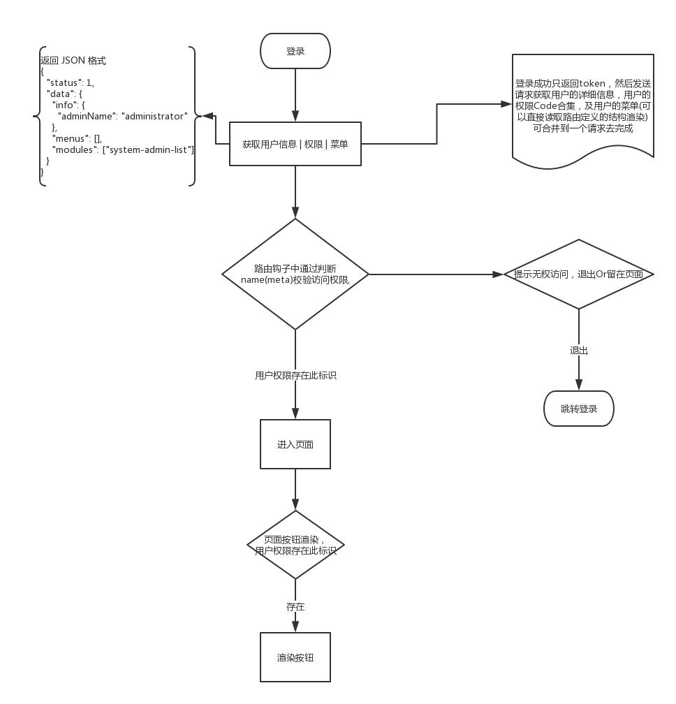
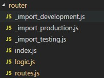
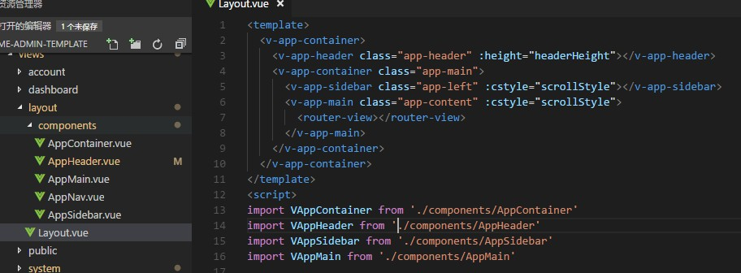

## 前后端分离后权限的思路

前后端分离关于权限的处理每个人都不一样，根据项目选择制定合适的方案就好  
我的方案是：

* 前端挂载所有路由
* 通过 Api 接口获取用户权限标识(路由名称)
* 在路由切换的时候进行权限校验
* 至于页面的权限按钮则通过指令+自定义组件的形式封装成通用权限按钮，通过传入相应的标识判断是否现实按钮
* 大体流程如下图所示  
  

## 前后端分离权限的实现

1.  路由中定义是否需要验证权限：`meta:{ auth :true }`

### 路由定义

若是后端项目，一般会包含公用的头部，侧边导航等公用的部分，这些部分可以将其抽象成一个个组件，创建布局页使其更简单的使用关于路由的引用，在大的项目中发现不适用懒加载能够更快的热更新，所以可以根据环境采取不同的加载方式一个简单的路由

#### 路由结构图



* `_import.[env].js`:

生产环境( production )/ testing 的定义
`module.exports = file => () => import('@/views/' + file + '.vue')`
开发环境( development )的定义
`module.exports = file => require('@/views/' + file + '.vue').default`
路由导入代码

* `index.js` : 使用 vue-router 挂载路由

```js
import Vue from 'vue'
import Router from 'vue-router'
import { routes } from './routes'
import logic from './logic'
Vue.use(Router)

const router = new Router({
  //   mode: 'history',
  routes
})
router.beforeEach(logic.beforeEach)
router.afterEach(logic.afterEach)

export default router
```

* `logic.js` : 路由钩子的实现

```js
import { getInfo } from '@/api/modules/account'
const beforeEach = (to, from, next) => {
  if (!to.meta.auth) {
    return next()
  }
  if (!localStorage.token) {
    return next('/login')
  }
  if (window.info) return next()
  getInfo().then(res => {
    localStorage.token = res.data.info.token
    window.info = res.data.info
    window.menus = res.data.menus
    window.modules = res.data.modules
    next()
  })
}
const afterEach = (to, from) => {}

export default {
  beforeEach,
  afterEach
}
```

* `routes.js`：路由的模块定义

```js
const _import = require('./_import_' + process.env.NODE_ENV)

export const appRouter = [
  {
    path: '/',
    component: Layout,
    children: [
      {
        path: '',
        name: 'home',
        component: _import('dashboard/index'),
        meta: { defAuth: true, auth: true }
      }
    ]
  }
]
export const routes = [...appRouter]
```

### 接口定义

* account/login
  登录成功返回 token，保存到本地跳转页面
* auth/info
  校验是否有 token 信息及登录信息，无则发送请求获取登录信息，菜单及权限模块标识列表

### 菜单加载

新建 Layout 文件夹，将各部分组件再拆成小组件进行拼接后台组件，样式使用圣杯布局，然后稍加改动就能够实现基本的后台管理页布局
Layout 结构图


菜单结构：

```json
"menus": [
      {
        "menuName": "控制台",
        "menuIcon": null,
        "menuCode": "home",
        "menuUrl": null
      },
      {
        "menuName": "系统管理",
        "menuIcon": null,
        "children": [
          {
            "menuName": "管理员管理",
            "menuIcon": null,
            "children": [
              {
                "menuName": "管理员列表",
                "menuIcon": null,
                "menuCode": "system-admin-list",
                "menuUrl": null
              }
            ]
          },
          {
            "menuName": "角色列表",
            "menuIcon": null,
            "menuCode": "system-role-list",
            "menuUrl": null
          }
        ]
      }
    ],
```

递归生成菜单组件

```html
<template>
    <dl>
        <template v-for="(item,index) in menus">
            <dt :key="item.menuName">
                <a href="javascript:;" v-if="item.menuUrl" @click="$ui.redirect(item.menuUrl)">{{item.menuName}}</a>
                <router-link :to="{name:item.menuCode}" v-else-if="item.menuCode">{{item.menuName}}</router-link>
                <span v-else>{{item.menuName}}</span>
            </dt>
            <dd class="child-menu" :key="'c_'+index" v-if="item.children&&item.children.length>0">
                <v-app-nav :menus="item.children" />
            </dd>
        </template>
    </dl>
</template>

<script>
export default {
  name: 'v-app-nav',
  props: ['menus']
}
</script>

<style>
</style>
```

### 指令封装

可以通过指令传入需要的权限标识值，进行对按钮权限的控制，根据需要控制显示/启用

#### 定义

```js
export default {
  auth: {
    inserted: (el, binding) => {
      if (window.modules.indexOf(binding.value) === -1) {
        // el.remove()
        el.setAttribute('disabled', 'disabled')
      }
    }
  }
}
```

#### 使用

对于常用的一些按钮，应封装到组件中，统一管理风格，也能使起更易维护

```js
<button v-auth="'role_create_create'">添加</button>
```
